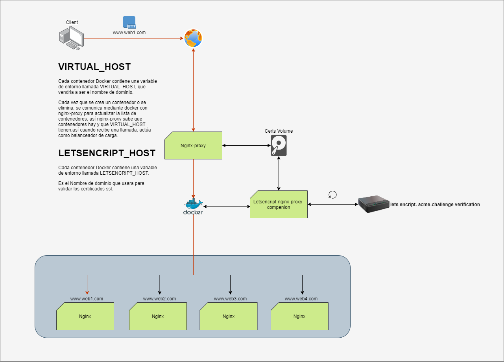

# Introduccón

En este post vamos a ver como crear un servidor proxy inverso y automatizar la creación de los certificados ssl seguros 100% usando letsencript y NGINX-proxy en DOCKER creando así un balanceador de cargas redireccionando por nombre de dominio las peticiones http/https entrantes cada una a su  servicio web nginx correspondiente.

### Como funciona:

Tenemos varios contenedores corriendo, (servidores web NGINX)  (contenedor1) www.web1.com, (contenedor2) www.web2.com,(contenedor3) www.web3.com,
el contenedor NGINX-Proxy tiene acceso a la api de docker, asi cada vez que es creado o eliminado un contender actualiza la tabla de contenedores.
En cada contenedor usaremos las variables de entorno VIRTUAL_HOST y LETSENCRIPT_HOST.

- VIRTUAL_HOST: Esta variable la usa nginx-proxy para redirigir el trafico al contenedor según el nombre de dominio de la petición

- LETSENCRIPT_HOST: el contenedor letsencript también tiene acceso a la api de docker, así puede ver que contenedores tienen la variable LETSENCRIPT_HOST y generar  automáticamente certificados ssl y los valida con los servidores letsencript para que sean seguros (de confianza), asi cada 60 minutos (1 hora) verifica que los certificados estén bien y si están cerca de caducar o caducados los renovará automáticamente.

### Ejemplo: 

tenemos expuesto el servidor nginx-proxy en el puerto 80, usaremos el nombre de dominio www.web1.com, el contenedor 1 (con la la variable VIRTUAL_HOST=wwww.web1.com).
cada vez que nuestro nginx-proxy reciba la petición http/https wwww.web1.com redirigirá el trafico al contenedor 1.

> WARNING : **Para este paso hace falta tener el nombre de dominion externalizado (servidor DNS) apuntando a nuestra ip publica, si no no podrá validar los certificados desde los servidores de letsencript**

# Importante
- Ver y completar docker-compose.yaml

# Ejecutar
 > CMD : **docker-compose up -d**
